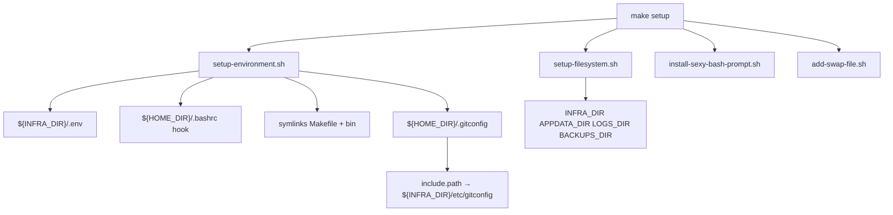

# Make — guide d’utilisation

Documentation du `Makefile` racine de ce dépôt (templates Docker / infra). Cible principale : **`make setup`**.

```sh
make help          # liste des cibles documentées (##)
cd /chemin/du/repo # ou INFRA_DIR=/infra sur les serveurs
```

---

## Concepts

| Concept | Rôle |
|---------|------|
| **Branche ≈ stack** | Une branche git porte en général un projet (`dokploy`, `teleport`, …). `master` porte le socle Make + `bin/` + conventions. |
| **`INFRA_DIR`** | Racine du dépôt déployé (souvent `/infra`). **Pas** de chemins `~/` pour les fichiers partagés. |
| **`ENV_FILE`** | Fichier d’environnement chargé par Make et les scripts. Défaut : `${INFRA_DIR}/.env`. |
| **`HOME_DIR`** | Home de `ADMIN_USER` (via `getent`) — uniquement pour `.bashrc`, `.gitconfig`, symlinks utilisateur. |

### Chargement de l’environnement

1. Make définit `INFRA_DIR ?= $(CURDIR)` puis `ENV_FILE ?= $(INFRA_DIR)/.env`.
2. Si le fichier existe : `-include` + **export** des clés (requis pour `docker stack deploy`, qui ne lit pas `.env` tout seul).
3. Les scripts sous `bin/` sourcent `bin/utils.sh`, qui repart de `${INFRA_DIR}/.env` sauf si `ENV_FILE` est déjà exporté.

**Attention Make :** un `$` seul dans `.env` est interprété par GNU Make. Préférer des valeurs plaines ; pour Compose, doubler en `$$` si besoin.

Modèle de clés : [`.env.example`](../.env.example).

---

## `make setup` (détail)

Bootstrap d’un nœud (identité, chemins, git, prompt, swap optionnel).

```sh
# Depuis le clone (idéalement déjà à INFRA_DIR=/infra)
make setup \
  ADMIN_USER=admin \
  INSTANCE_NAME=pivot01 \
  INFRA_NAME=ocrx \
  INFRA_DOMAIN=example.com

# SSH : TTY recommandé pour le prompt / certains outils
ssh -t host 'cd /infra && make setup ADMIN_USER=admin INSTANCE_NAME=... INFRA_NAME=... INFRA_DOMAIN=...'
```

### Prérequis

| Variable | Obligatoire | Défaut / source |
|----------|-------------|-----------------|
| `ADMIN_USER` | oui | `SUDO_USER` / `whoami` si déjà exporté |
| `INSTANCE_NAME` | oui | hostname court |
| `INFRA_NAME` | oui | — (à fournir) |
| `INFRA_DOMAIN` | oui | — (à fournir) |
| `INFRA_DIR` | non | Make : `$(CURDIR)` ; scripts : `/infra` |
| `ENV_FILE` | non | `${INFRA_DIR}/.env` |
| `APPDATA_DIR` | non | `/appdata` |
| `LOGS_DIR` / `BACKUPS_DIR` | non | sous `APPDATA_DIR` |
| `ENABLE_SWAP_FILE` | non | `false` — mettre `true` pour créer le swap |
| `SWAP_SIZE` / `SWAP_FILE` | non | `4G` / `/var/0.swap` |

Passwordless sudo (`sudo -n true`) recommandé pour hostname, `/etc/hosts`, sysctl, crontab, swap, prompt système.

### Enchaînement (4 scripts)



#### 1. `bin/setup-environment.sh`

- Charge l’env existant sans écraser les exports Make/CLI.
- Exige `ADMIN_USER`, `INSTANCE_NAME`, `INFRA_NAME`, `INFRA_DOMAIN`.
- (Ré)écrit le bloc **Infra Environment variables** dans `${ENV_FILE}` (conserve ce qui précède le marqueur).
- Injecte un bloc dans `${HOME_DIR}/.bashrc` pour sourcer `ENV_FILE` à chaque login.
- Symlinks (si absents) : `${HOME_DIR}/Makefile` → `${INFRA_DIR}/Makefile`, `${HOME_DIR}/bin` → `${INFRA_DIR}/bin`.
- **Git :**
  - Recrée `${HOME_DIR}/.gitconfig`.
  - `include.path` absolu vers `${INFRA_DIR}/etc/gitconfig` (aliases `st`, `co`, `pom`, `pa`, …).
  - Pose `user.name` / `user.email` / `http.sslVerify` / `core.autocrlf` dans le fichier utilisateur.
  - Si `etc/gitconfig` manque → **warning** « git aliases not installed ».
- Si sudo NOPASSWD : hostname FQDN, `/etc/hosts`, `vm.swappiness=10`, crontab apt quotidien.

Vérifier les aliases après setup :

```sh
git config --get-regexp '^alias\.' | head
# ou: git la
```

#### 2. `bin/setup-filesystem.sh`

Crée (et `chown` vers `ADMIN_USER` si sudo) :

- `${INFRA_DIR}` (défaut `/infra`)
- `${APPDATA_DIR}` (défaut `/appdata`)
- `${LOGS_DIR}`, `${BACKUPS_DIR}`

#### 3. `bin/install-sexy-bash-prompt.sh`

Installe [sexy-bash-prompt](https://github.com/twolfson/sexy-bash-prompt). Avec sudo : copie dans `/etc/profile.d/`. Sinon : hook dans `${HOME}/.bashrc` (chemins `${HOME}/…`, pas `~/`).

#### 4. `bin/add-swap-file.sh`

No-op sauf si `ENABLE_SWAP_FILE=true|1`. Nécessite sudo NOPASSWD. Paramètres : `SWAP_SIZE`, `SWAP_FILE`.

### Idempotence / re-run

- `make setup` peut être relancé : le bloc infra dans `.env` et le hook bashrc sont remplacés proprement.
- `.gitconfig` utilisateur est **recréé** à chaque run (les réglages manuels hors include seront perdus).
- Les symlinks `Makefile` / `bin` ne sont créés que s’ils n’existent pas déjà.

### Exemple serveur type

```sh
sudo mkdir -p /infra /appdata
sudo chown admin:admin /infra /appdata
# cloner ce dépôt dans /infra
cd /infra
cp .env.example .env   # optionnel ; setup réécrit le bloc infra
make setup \
  ADMIN_USER=admin \
  INSTANCE_NAME="$(hostname -s)" \
  INFRA_NAME=monprojet \
  INFRA_DOMAIN=example.com \
  INFRA_DIR=/infra \
  APPDATA_DIR=/appdata \
  ENABLE_SWAP_FILE=true
```

---

## Autres cibles Make (aperçu)

### Docker (Compose)

| Cible | Usage |
|-------|--------|
| `docker-login` | Login registry (`DOCKER_REGISTRY_*` dans `.env`) |
| `docker-project-up` / `down` / `restart` / `logs` / `watch` | `PROJECT_NAME=<dossier>` |
| `docker-pull-images` / `docker-project-upgrade` | Pull puis recreate |

Le fichier compose est résolu par `bin/resolve-project-compose.sh` (`docker-compose.yml` ou `stack-compose.yml`, + override optionnel).

### Swarm

| Cible | Usage |
|-------|--------|
| `swarm-init` | `SWARM_ADVERTISE_ADDR` ou IP auto (`bin/ip_address.sh`) |
| `swarm-join` | `SWARM_TOKEN` + `SWARM_JOIN_ADDRESS` |
| `swarm-leave` / `swarm-info` / `swarm-unlock*` | Ops cluster |

### Stack (Swarm)

| Cible | Usage |
|-------|--------|
| `stack-deploy` | `STACK_NAME=<projet>` ; Make exporte `.env` puis `docker stack deploy -c …` |
| `stack-rm` | Supprime le stack |
| `stack-logs` / `stack-watch-logs` | Logs fusionnés des services |

`STACK_DEPLOY_WAIT=1` (défaut) : tente `--detach=false` si le CLI le supporte.

Les stacks applicatifs ajoutent souvent `-include <projet>/Makefile` (ex. `dokploy-stack-up`). Sur `master`, le socle générique est ci-dessus ; les cibles projet vivent sur leur branche.

### Infra diverse

| Cible | Rôle |
|-------|------|
| `update-server` | `bin/server-update.sh` |
| `fix-dns-resolv` | `bin/fix-dns-resolv.sh` |
| `add-swap-file` | Swap seul (mêmes vars que dans setup) |
| `services-list` | `docker service ls` |
| `.create-db` | `DB_USER` `DB_PASS` `DB_NAME` → `bin/create-db.sh` |
| `commit-changes` | add/commit/push générique (à utiliser avec prudence) |

---

## Bonnes pratiques

1. Toujours travailler avec un `.env` sous **`INFRA_DIR`**, pas sous `~/`.
2. Pour Swarm : déployer via **Make** (export d’env), pas un `docker stack deploy` nu.
3. Ne pas committer `.env` (secrets) — seulement `.env.example`.
4. Garder [`etc/gitconfig`](../etc/gitconfig) dans le dépôt : sans ce fichier, `make setup` n’installe pas les aliases git.
5. Sur SSH non interactif, préférer `ssh -t` pour `make setup` si tu veux un vrai TTY.

---

## Dépannage rapide

| Symptôme | Piste |
|----------|--------|
| `required variables are missing` | Passer `INFRA_NAME` / `INFRA_DOMAIN` (et les autres) en CLI ou dans `.env` |
| Pas d’aliases git | Vérifier que `${INFRA_DIR}/etc/gitconfig` existe ; relancer setup ; `git config --get include.path` |
| Stack sans variables | Confirmer que Make a bien inclus/exporté `${ENV_FILE}` |
| Swap ignoré | `ENABLE_SWAP_FILE=true` + sudo NOPASSWD |
| Hostname / hosts non mis à jour | sudo NOPASSWD manquant (warning dans les logs setup) |
